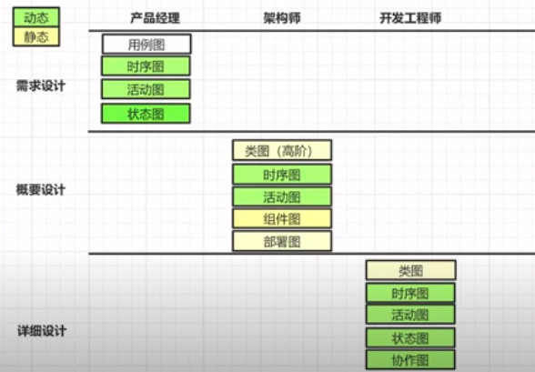
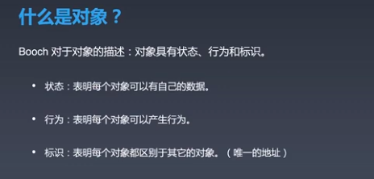

# Day-03

第一张画的图是：部署图，有了部署图之后，才是画组件图（静态关系），组件之间的关系可以通过时序图（动态图）来体现的。

## 7种UML图

需求分析多数情况下是有产品经理来作的，而概要设计和详细设计是由架构师来作的。

作业：http://www.uml.org.cn/appCase/200701244.asp

## UML 图分类

* 静态图：用例图，对象图，类图，组件图，包图，部署图
* 动态图：序列图，活动图，状态图，协作图

## 框架设计

架构师实现自己架构目标的主要手段。

* 在工作中有机会就多画UML设计图。

* 对开源框架进行反设计：根据实现的代码，画出UML图。

工作中，掌握架构，掌握技术，遇到问题都来问我，才能够体现价值。通过不同的文档，不同的图形来表达自己的想法，同时将自己的想法告知投资方，老板，相关方，来支持自己的工作，自己的想法，从而让自己有时间来掌控其他的方面，开始自己的设计并实现。

## 软件开发简史

从编程的历史看编程的本质和未来。

架构师：技术要知道，还要存在超越其他开发者的能力，全局把控的能力，超越别人的技术在那里。

### 莱布尼兹

与牛顿同时代的人，与牛顿关于谁发明微积分打了一辈子官司。

人：把逻辑描述清楚后，人就能够工作了。

### 第一位程序媛

英国人 Ada，19世纪中页写出了符合程序定义的程序。

### 计算机程序

### 现代计算机与程序

### 编程语言

### 编程语言的实质

领域问题 ----分析、抽象----> 模型 ---- 设计、抽象----> 软件系统 ---- 开发、实现 ----> 模型

### 编程的核心要素

面向对象是编程的终极形态。机器学习：面向数据编程，函数式编程，反应式编程。

## 面向对象编程

### 什么是对象

无状态对象：没有数据的对象，数据从方法来的，处理完了就丢弃了。无行为对象：没有行为的对象。

### 三要素

封装并不是面向对象特有的。

继承也不是面向对象独有，比如C可以通过结构体间的包含关系来实现。

多态：对象互换的魔法，面向接口编程，我们一个抽象的类定义，不同的类有不同的实现，在运行期：使用的是具体的实现类，程序运行使用的是接口，在运行时才决定具体使用的时那个具体的实现。

多态也不是面向对象所特有的，C语言中的函数指针，范型编程也能够实现多态。

